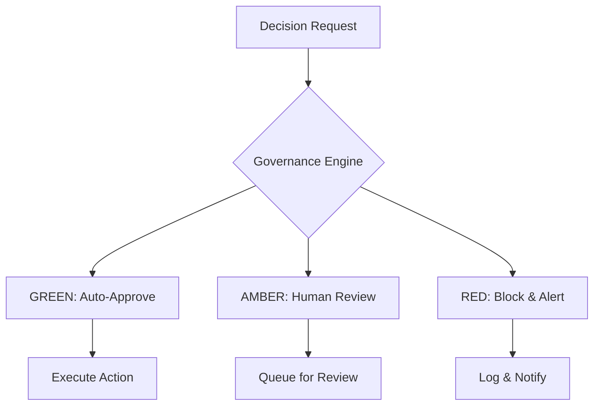

# SENTINEL AI Architecture

## System Overview

SENTINEL AI implements a distributed, event-driven architecture designed for high-reliability AI governance. The system is built around microservices principles with clear separation of concerns and robust fault tolerance mechanisms.

## Core Components

### 1. Governance Engine

**Purpose**: Central decision evaluation and approval system
**Technology**: Node.js/TypeScript microservice
**Responsibilities**:
- Decision intake and queuing
- Risk assessment algorithms
- GREEN/AMBER/RED classification
- Audit logging

**Architecture Patterns**:
- Event sourcing for decision history
- CQRS for read/write optimization
- Circuit breaker for fault tolerance

### 2. Agent Network

**Purpose**: Specialized AI agents for domain-specific tasks
**Technology**: Containerized Python/Node.js services
**Responsibilities**:
- Task-specific decision making
- Domain expertise application
- Result generation and validation

**Communication**: RESTful APIs with WebSocket for real-time updates

### 3. Workflow Orchestrator

**Purpose**: Business process automation and sequencing
**Technology**: n8n workflow engine
**Responsibilities**:
- Process definition and execution
- Integration with external systems
- Error handling and retry logic

**Key Workflows**:
- Recruiter evaluation pipeline
- Decision approval workflows
- Notification and alerting

### 4. Data Layer

**Components**:
- **PostgreSQL**: Structured data storage
- **Pinecone**: Vector database for semantic search
- **Redis**: Caching and session management

**Data Flow**:
```
Raw Data → Processing Pipeline → Structured Storage → Vector Indexing → Query Interface
```

### 5. Integration Layer

**Purpose**: External system connectivity
**Supported Integrations**:
- Claude API for AI model access
- Telegram for notifications
- Google Sheets for data export
- Webhooks for custom integrations

## Architecture Patterns

### Event-Driven Design

The system uses event-driven architecture for loose coupling:



### Microservices Communication

Services communicate through:
- REST APIs for synchronous operations
- Message queues (RabbitMQ) for asynchronous processing
- WebSockets for real-time updates

### Security Architecture

**Defense in Depth**:
- API Gateway with authentication/authorization
- End-to-end encryption
- Input validation and sanitization
- Rate limiting and DDoS protection
- Audit logging and monitoring

### Scalability Considerations

**Horizontal Scaling**:
- Stateless services for easy replication
- Database read replicas
- CDN for static assets
- Load balancing across instances

**Performance Optimization**:
- Caching layers (Redis)
- Database indexing strategies
- Asynchronous processing
- Resource pooling

## Deployment Architecture

### Development Environment
- Local Docker Compose setup
- Hot reloading for development
- Integrated debugging tools

### Production Environment
- Kubernetes orchestration
- Multi-region deployment
- Blue-green deployment strategy
- Automated rollbacks

### Monitoring & Observability

**Metrics Collection**:
- Application performance monitoring
- Business metrics tracking
- Error rate and latency monitoring
- Resource utilization tracking

**Logging Strategy**:
- Structured logging with correlation IDs
- Centralized log aggregation
- Log retention policies
- Real-time alerting

## Data Architecture

### Schema Design

**Core Entities**:
- Decisions: Central entity for all governance actions
- Agents: Registered AI agents with capabilities
- Workflows: Process definitions and executions
- AuditLogs: Immutable audit trail

**Relationships**:
```
Agent -- executes --> Decision
Decision -- part_of --> Workflow
Workflow -- generates --> AuditLog
```

### Data Flow Patterns

1. **Decision Lifecycle**:
   - Creation → Evaluation → Approval/Denial → Execution → Archival

2. **Agent Interaction**:
   - Registration → Task Assignment → Execution → Result Submission → Scoring

3. **Workflow Execution**:
   - Trigger → Step Execution → Result Aggregation → Completion

## Reliability & Resilience

### Fault Tolerance
- Graceful degradation
- Automatic failover
- Data consistency guarantees
- Recovery procedures

### Backup & Recovery
- Regular database backups
- Point-in-time recovery
- Disaster recovery planning
- Data integrity checks

## Future Considerations

### Extensibility
- Plugin architecture for new agents
- API versioning strategy
- Backward compatibility guarantees

### Performance
- Query optimization
- Caching strategies
- Resource allocation
- Bottleneck identification

### Security Evolution
- Regular security audits
- Vulnerability management
- Compliance updates
- Threat modeling</content>
<parameter name="filePath">/Users/babukunadian/Desktop/sentinel-ai/docs/architecture.md